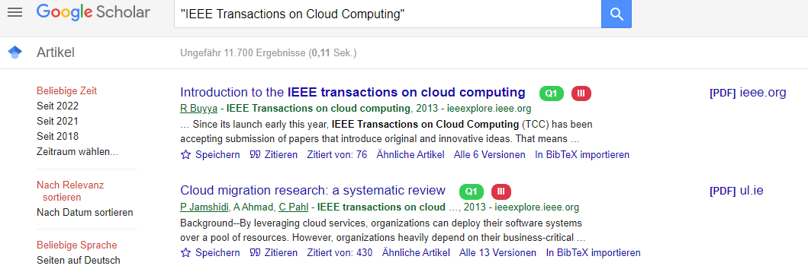

<h1 align="center"> RapidJournalQualCheck </h1> 
<h3 align="center">   Rapid Quality Check for Journals based on SJR and CCF </h3>

    

<b> Chrome extension to display SJR along with the H-Index and CCF score next to Google Scholar search results. </b>

 Based on and adapted from CCFrank by WenyanLiu: https://github.com/WenyanLiu/CCFrank4dblp
  Using the public Crossref API: https://api.crossref.org/swagger-ui/index.html
  Using SCImago Journal & Country Rank (retrieved July 20th, 2022): http://www.scimagojr.com
  Using China Computer Federation (CCF) ranking: https://www.ccf.org.cn/en/Bulletin/2019-05-13/663884.shtml
  Icons from Flaticon.com: https://www.flaticon.com/free-icons/research

## Preview

SJR quality scores with checked journal title and h-index mouseover 

SJR and CCF quality scores with checked journal title in mouseover

## Install

<b>I. Directly install from the Chrome Store --> coming soon </b>

	1. Find the RapidJournalQualCheck extension in [Chrome Web Store](https://chrome.google.com/webstore/)

	2. Click the `Add to Browser` button.

	3. RapidJournalQualCheck needs to read and change dblp, Google Scholar. To approve, click `Add extension`.

OR

<b>II. Load Unpacked</b>

	1. Clone RapidJournalQualCheck to a directory.

	2. Open the Extension Management page by navigating to `chrome://extensions`.
 	   - The Extension Management page can also be opened by clicking on the Chrome menu, hovering over **More Tools** then
  	    selecting **Extensions**.

	3. Enable Developer Mode by clicking the toggle switch next to **Developer mode**.

	4. Click the **LOAD UNPACKED** button in the top left corner and select the directory holding RapidJournalQualCheck.

## What's New

**Version 1.0.2**

> tbd

## Contributors ✨

This package is heavily based on CCFrank by WenyanLiu: https://github.com/WenyanLiu/CCFrank4dblp
Thanks goes to her and her contributors: https://github.com/WenyanLiu/CCFrank4dblp#contributors-

 Using the public Crossref API: https://api.crossref.org/swagger-ui/index.html

 Using SCImago Journal & Country Rank (retrieved July 20th, 2022): http://www.scimagojr.com

 Using China Computer Federation (CCF) ranking: https://www.ccf.org.cn/en/Bulletin/2019-05-13/663884.shtml

 Icons from Flaticon.com: https://www.flaticon.com/free-icons/research

Contributions of any kind welcome!

## Reports
